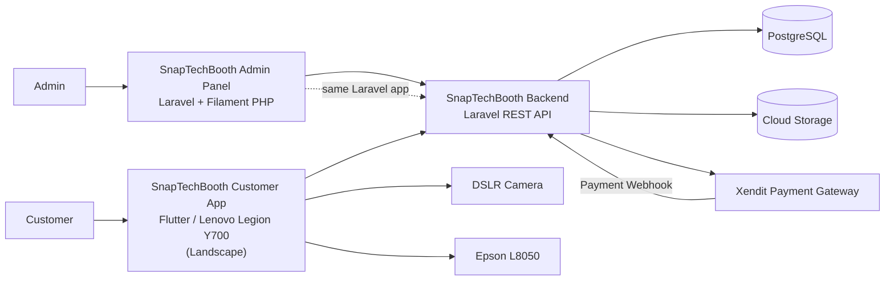

# System Context Diagram

## Notes
- Admin Panel and REST API are the **same Laravel application**.
- No email service in the system.

## Actors
| Actor | Description |
|-------|-------------|
| Customer | Uses the Flutter kiosk app on Lenovo Legion Y700 (landscape) |
| Admin | Manages events, frames, filters, screens, transactions, reports via Filament admin panel |
| Xendit | Payment gateway — sends PAID webhook to backend |
| DSLR | Captures photos triggered by Flutter app |
| Epson L8050 | Prints final result automatically when Result Screen is shown |
