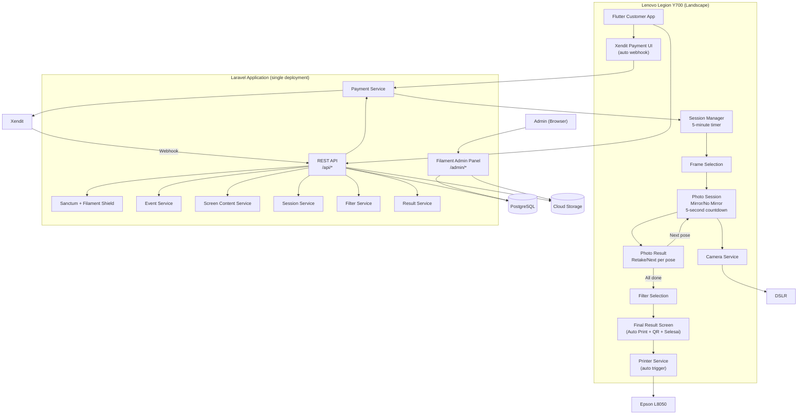

# High-Level Architecture

```mermaid
flowchart TD
    subgraph CustomerDevice["Lenovo Legion Y700 (Landscape)"]
        UI["Flutter Customer App"]
        PAYMENT["Xendit Payment UI\n(auto webhook)"]
        SESSION["Session Manager\n5-minute timer"]
        FRAME["Frame Selection"]
        PHOTO["Photo Session\nMirror/No Mirror\n5-second countdown"]
        PHOTO_RESULT["Photo Result\nRetake/Next per pose"]
        FILTER["Filter Selection"]
        RESULT["Final Result Screen\n(Auto Print + QR + Selesai)"]
        CAMERA["Camera Service"]
        PRINT["Printer Service\n(auto trigger)"]
    end

    subgraph LaravelApp["Laravel Application (single deployment)"]
        API["REST API\n/api/*"]
        FILAMENT["Filament Admin Panel\n/admin/*"]
        AUTH["Sanctum + Filament Shield"]
        EVENT["Event Service"]
        CONTENT["Screen Content Service"]
        PAYMENTAPI["Payment Service"]
        SESSIONAPI["Session Service"]
        FILTERAPI["Filter Service"]
        RESULTAPI["Result Service"]
    end

    DB[("PostgreSQL")]
    STORAGE[("Cloud Storage")]
    X["Xendit"]
    DSLR["DSLR"]
    EPSON["Epson L8050"]
    ADMINBROWSER["Admin (Browser)"]

    UI --> PAYMENT
    PAYMENT --> PAYMENTAPI
    PAYMENTAPI --> X
    X -->|Webhook| API
    PAYMENTAPI --> SESSION
    SESSION --> FRAME
    FRAME --> PHOTO
    PHOTO --> PHOTO_RESULT
    PHOTO_RESULT -->|Next pose| PHOTO
    PHOTO_RESULT -->|All done| FILTER
    FILTER --> RESULT
    PHOTO --> CAMERA
    RESULT --> PRINT
    CAMERA --> DSLR
    PRINT --> EPSON
    UI --> API
    ADMINBROWSER --> FILAMENT
    API --> AUTH
    API --> EVENT
    API --> CONTENT
    API --> PAYMENTAPI
    API --> SESSIONAPI
    API --> FILTERAPI
    API --> RESULTAPI
    API --> DB
    API --> STORAGE
    FILAMENT --> DB
    FILAMENT --> STORAGE
```

## No Email
No email service, no email component, no email flow anywhere.
