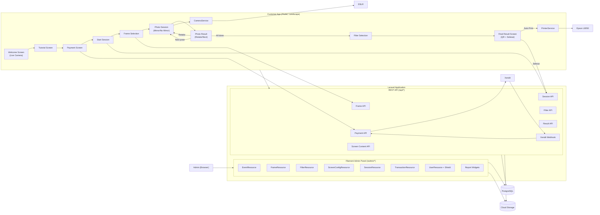

# Component Diagram

## No Email
No email component, no email service, no email API anywhere in this diagram.

## Result Screen
| Element | Behaviour |
|---------|-----------|
| QR Code | Links to `GET /api/results/{token}` — GIF, final result, individual photos |
| Auto Print | `PrinterService` → Epson L8050 on screen arrival |
| **Selesai** | `POST /sessions/{session}/finish` → Welcome |
