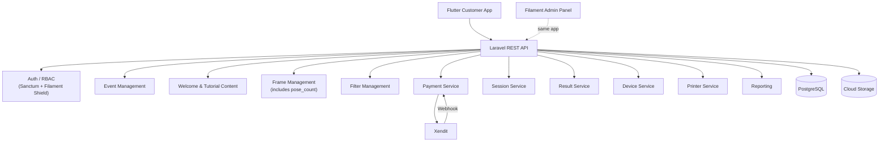

# Backend Architecture

## Single Laravel App — Two Entry Points

| Entry Point | Purpose |
|-------------|---------|
| `POST /api/...` | REST API consumed by Flutter customer app |
| `/admin/...` | Filament admin panel consumed by browser |

## Session business rule

`Payment PAID → Start Session (timer 05:00) → Select Frame → Photo Session (Mirror/No Mirror) → Countdown 5s → Capture → Photo Result (Retake/Next) → [repeat per pose] → Filter Selection → Processing → Final Result (Auto Print + QR) → Selesai → Finish`

The session deadline is `started_at + 5 minutes`.

## Result Service responsibilities
1. Receive uploaded photos + selected filter
2. Apply filter to compose final photobooth strip → `final_url`
3. Generate animated GIF from all captures → `gif_url`
4. Generate `qr_token` → stored in RESULTS table
5. Trigger print job to Epson L8050 (automatic)
6. Return result payload to Flutter for Final Result Screen

## No Email
No email service, no email endpoint, no email field anywhere.
