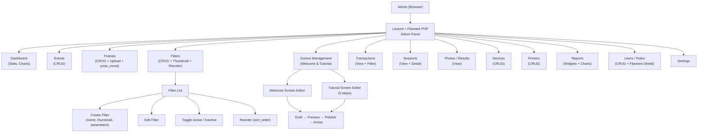

# Admin Architecture

## Filament Resources

| Resource | Description |
|----------|-------------|
| `EventResource` | CRUD events, toggle active |
| `FrameResource` | CRUD frames, upload asset_url, set pose_count, toggle active |
| `FilterResource` | CRUD filters, upload thumbnail_url, toggle active, reorder |
| `ScreenConfigResource` | Welcome/Tutorial editor + Preview/Publish actions |
| `SessionResource` | View-only, detail with photos + result + print jobs |
| `TransactionResource` | View payment records |
| `ResultResource` | View final results, QR tokens |
| `DeviceResource` | CRUD devices |
| `PrinterResource` | CRUD printers |
| `UserResource` | CRUD users + Filament Shield roles |

## No Email
No email management in admin panel.
