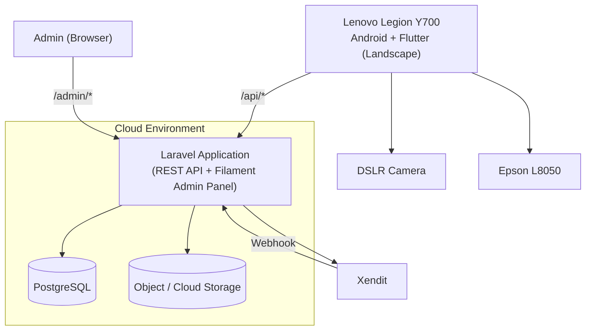

# Deployment Diagram

## Notes
- Single Laravel deployment serves both `/api/*` and `/admin/*`
- No email service in deployment
- Flutter runs in **landscape** orientation on Lenovo Legion Y700
- Epson L8050 triggered automatically when Final Result Screen is shown
