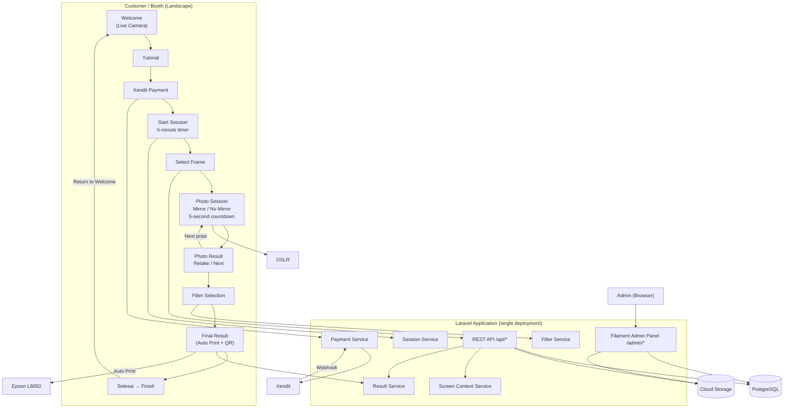

# Complete Architecture



## Final Result Screen

```
┌──────────────────────┬──────────────────┐
│                      │                  │
│                      │   QR DOWNLOAD    │
│   FINAL PHOTO        │                  │
│     PREVIEW          │   [ QR CODE ]    │
│                      │                  │
│                      │ Scan untuk       │
│                      │ download hasil   │
└──────────────────────┴──────────────────┘

              [ ✓ SELESAI ]
```

| Element | Behaviour |
|---------|-----------|
| Final Photo Preview | Composed photobooth strip with selected filter |
| QR Code | Links to `GET /api/results/{token}` — download GIF, final result, individual photos |
| Auto Print | Epson L8050 triggered automatically on screen arrival |
| **Selesai** button | Calls `POST /sessions/{session}/finish` → Welcome Screen |

**No email. No Kirim button. No email input.**
