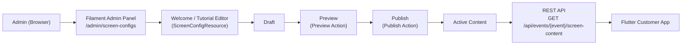

# Content Management Architecture

## Tutorial Steps
Tutorial has **5 steps** (stored as TUTORIAL_STEPS records):

| Step | Title | Description |
|------|-------|-------------|
| 1 | BAYAR | Scan QRIS untuk melakukan pembayaran |
| 2 | PILIH FRAME | Pilih frame favorit untuk foto kamu |
| 3 | AMBIL FOTO | Siapkan pose dan foto akan diambil setelah countdown |
| 4 | LIHAT HASIL | Lihat hasil foto dan pilih filter yang kamu suka |
| 5 | DOWNLOAD & CETAK | Scan QR untuk download hasil atau cetak foto |

Admin can edit these steps via the Tutorial Screen Editor in Filament.

## No Email
No email content, no email screen, no email management.
