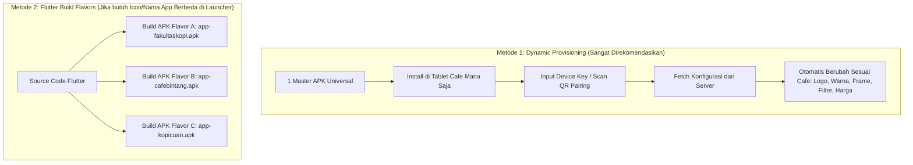
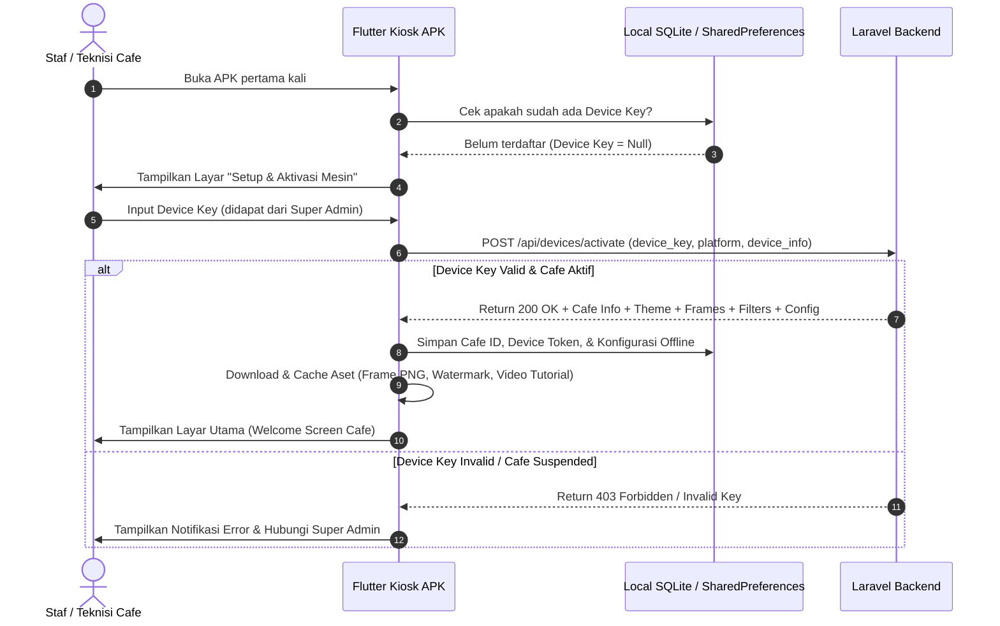
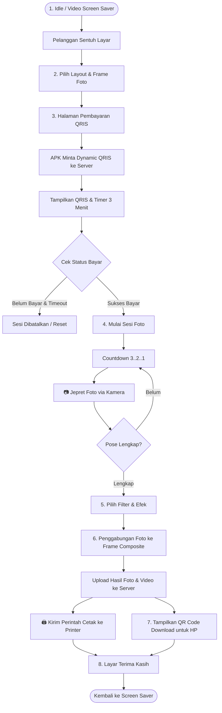
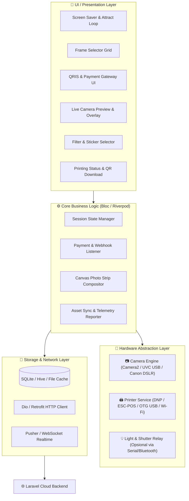

# Arsitektur & Alur Kerja Flutter Kiosk APK (Multi-Tenant Photobooth)

Dokumen ini menjelaskan rancangan arsitektur, alur kerja (workflow), serta integrasi hardware (Kamera, Printer, Pembayaran) untuk aplikasi Android Photobooth (Flutter APK).

---

## 1. Strategi Multi-Tenant: Bagaimana Setiap Cafe Memiliki Tampilan & Sistem Berbeda?

Ada 2 pendekatan teknis untuk mengelola perbedaan tiap cafe:



> [!TIP]
> **Rekomendasi Utama: Metode 1 (Dynamic Provisioning)**
> Anda hanya perlu membuat & memelihara **1 file APK saja**. Saat APK dipasang di tablet/kiosk cafe baru, staf hanya memasukkan **Device Pairing Key** yang digenerate dari Super Admin. Aplikasi otomatis mendownload identitas cafe tersebut.

---

## 2. Diagram Alur Pairing & Inisialisasi Kiosk (Onboarding)

Alur ketika mesin booth pertama kali diinstal di lokasi cafe:



---

## 3. Diagram Alur Transaksi Pelanggan (Customer Journey)

Alur lengkap mulai dari pelanggan mendekat ke booth sampai cetak foto dan scan QR download:



---

## 4. Diagram Arsitektur Komponen Flutter APK

Struktur modul internal dalam aplikasi Flutter:



---

## 5. Rincian Integrasi Hardware (Kamera, Printer, Pembayaran)

### A. Integrasi Kamera (Camera Driver)
1. **Kamera Built-in Tablet / Android**:
   - Menggunakan package `camera` Flutter dengan resolusi Full HD (1920x1080) atau 4K.
2. **Kamera Eksternal USB (Webcam Logitech / USB Kiosk Camera)**:
   - Menggunakan package `flutter_uvc_camera` melalui kabel USB OTG.
3. **Kamera DSLR / Mirrorless (Canon EOS / Sony)**:
   - Terhubung via USB Tethering menggunakan PTP/IP protokol library Android.

### B. Integrasi Printer (Print Driver)
1. **Printer Foto Dye-Sublimation (DNP RX1HS / Citizen / Hiti)**:
   - Terhubung ke Android Box / Tablet via USB OTG atau Print Server lokal (CUPS / Raw TCP port 9100).
   - Ukuran cetak standar: 4R (4x6 inci) atau 2x6 strip potong otomatis (2 strips per 4R print).
2. **Thermal Receipt / Mini Photo (ESC/POS)**:
   - Terhubung via Bluetooth / USB menggunakan package `esc_pos_utils_plus` & `flutter_pos_printer_platform`.

### C. Integrasi Pembayaran (Payment Gateway)
1. **Dynamic QRIS (Xendit / Midtrans)**:
   - Setiap sesi membuat invoice QRIS unik.
   - Aplikasi mendengarkan status pembayaran via Polling `/api/payments/{id}/status` tiap 2 detik atau Push Notification via WebSocket.
2. **Opsi Bayar di Kasir (Voucher Code / Cashier Approval)**:
   - Pelanggan memasukkan kode voucher yang dibeli di kasir cafe.

---

## 6. Struktur Konfigurasi Dinamis yang Dikirim Server ke APK

Saat APK melakukan sync ke server (`GET /api/devices/{key}/config`), server mengembalikan JSON yang mengatur seluruh identitas cafe:

```json
{
  "status": "success",
  "data": {
    "cafe": {
      "id": 1,
      "name": "Fakultas Kopi",
      "code": "FK-BOOT-001",
      "theme": {
        "primary_color": "#D97706",
        "secondary_color": "#78350F",
        "background_url": "https://server.com/storage/themes/fk-bg.jpg",
        "logo_url": "https://server.com/storage/cafes/logos/fk.png"
      }
    },
    "pricing": {
      "session_price": 25000,
      "currency": "IDR",
      "print_copies_default": 2
    },
    "hardware_config": {
      "countdown_seconds": 5,
      "max_retakes": 1,
      "auto_print": true
    },
    "frames": [
      {
        "id": 1,
        "name": "Strip Vintage Coffee",
        "layout_type": "single",
        "pose_count": 4,
        "asset_url": "https://server.com/storage/frames/vintage.png"
      }
    ],
    "filters": [
      { "id": 1, "name": "Normal", "slug": "normal" },
      { "id": 2, "name": "Monochrome B&W", "slug": "bw" },
      { "id": 3, "name": "Warm Coffee", "slug": "warm" }
    ]
  }
}
```
