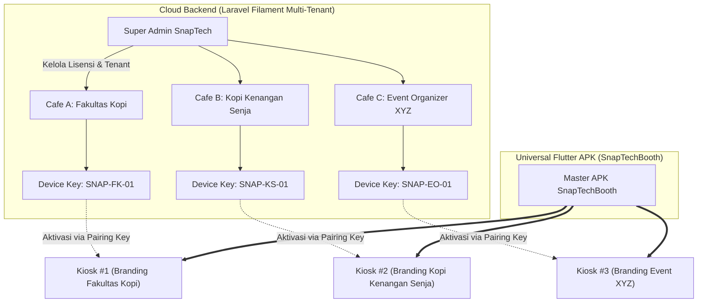
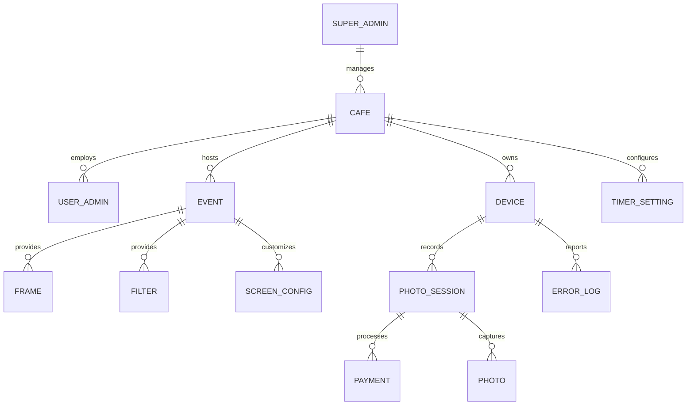
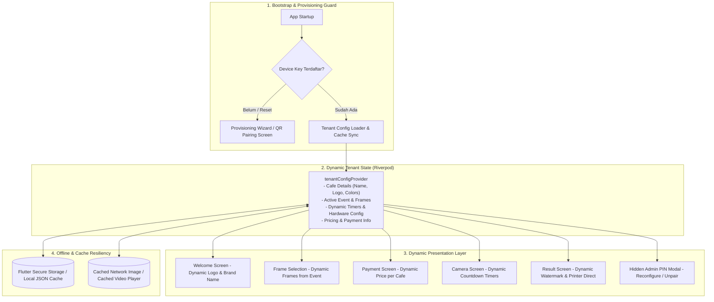

# SnapTechBooth Multi-Tenant Kiosk Architecture

Dokumen ini menguraikan arsitektur sistem **SnapTechBooth** (aplikasi kiosk Flutter universal) yang memungkinkan satu basis kode aplikasi (*Single Universal APK*) digunakan oleh banyak admin/tenant (*Multi-Tenant*) dengan identitas brand, tema, frame foto, paket harga, pengaturan timer, dan aset visual yang sepenuhnya dinamis.

---

## 1. Latar Belakang & Visi Produk

Sebelumnya, aplikasi Flutter Photobooth dikonfigurasi secara *hardcoded* untuk satu entitas brand saja (**Fakultas Kopi**). 

Dengan arsitektur **SnapTechBooth Multi-Tenant**, sistem berevolusi menjadi platform B2B Photobooth-as-a-Service:
1. **Universal White-Label APK**: 1 master APK SnapTechBooth dapat diinstal pada tablet Lenovo Legion Y700 / perangkat Android manapun.
2. **Dynamic Pairing & Ownership**: Setiap perangkat dihubungkan (*paired*) ke Admin Cafe / Tenant tertentu melalui **Device Pairing Key** atau **Scan QR Code Onboarding**.
3. **Dynamic Brand Identity**: Logo, nama brand, palet warna, video tutorial, frame foto, filter, harga sesi, hingga timer secara otomatis mengikuti konfigurasi Cafe/Tenant yang memiliki device tersebut.
4. **Tenant Isolation**: Data transaksi, galeri foto, error telemetry, dan laporan keuangan terisolasi per cafe di dashboard admin Laravel Filament.



---

## 2. Struktur Hierarki Multi-Tenant



### Entitas Utama:
| Entitas | Peran & Tanggung Jawab |
|---|---|
| **Super Admin** | Mengelola seluruh tenant cafe, alokasi lisensi, registrasi master device key, dan monitoring global. |
| **Cafe / Tenant Admin** | Mengelola event aktif, mengunggah frame kustom, mengatur harga tiket/sesi, melihat transaksi omzet harian, dan memonitor status kiosk miliknya. |
| **Device (Kiosk)** | Entitas perangkat fisik (tablet Android). Memiliki `device_key` unik, status telemetry (printer/kamera), dan terikat ke 1 cafe & 1 event aktif. |
| **Event** | Wadah kampanye/tema foto (misal: "Regular Booth", "Valentine Special", "Wedding Fest") yang berisi frame, filter, dan screen content spesifik. |

---

## 3. Komponen Arsitektur Flutter SnapTechBooth

Di dalam aplikasi Flutter, arsitektur dipecah menjadi lapisan modul modular yang reaktif:



---

## 4. Skema API Provisioning & Sinkronisasi

### A. Endpoint Aktivasi (`POST /api/devices/activate`)
Dipanggil saat pertama kali memasang APK di tablet atau saat *re-pairing*.

**Request Payload:**
```json
{
  "device_key": "SNAP-FK-8821",
  "platform": "android",
  "app_version": "1.2.0",
  "device_name": "Lenovo Legion Y700 - Booth 1"
}
```

**Response Payload:**
```json
{
  "success": true,
  "message": "Aktivasi mesin berhasil!",
  "data": {
    "device": {
      "id": 1,
      "name": "Kiosk Utama Lt 1",
      "device_key": "SNAP-FK-8821",
      "platform": "android"
    },
    "cafe": {
      "id": 2,
      "name": "Fakultas Kopi",
      "code": "FK-DEPOK-01",
      "address": "Jl. Margonda Raya No. 100",
      "logo_url": "https://api.snaptechbooth.com/storage/cafes/logos/fk_logo.png",
      "is_ai_enabled": true,
      "show_kiosk_settings": true,
      "theme": {
        "primary_color": "#D97706",
        "accent_color": "#78350F",
        "background_url": "https://api.snaptechbooth.com/storage/cafes/bg/default.jpg"
      }
    },
    "event": {
      "id": 5,
      "name": "Fakultas Kopi Main Booth"
    }
  }
}
```

---

### B. Endpoint Ambil Konfigurasi Lengkap (`GET /api/devices/{device_key}/config`)
Mengambil seluruh konfigurasi aset visual, timer, frame, dan filter.

```json
{
  "success": true,
  "data": {
    "cafe": {
      "id": 2,
      "name": "Fakultas Kopi",
      "logo_url": "https://api.snaptechbooth.com/storage/cafes/logos/fk_logo.png",
      "theme": {
        "primary_color": "#D97706",
        "accent_color": "#78350F"
      }
    },
    "pricing": {
      "session_price": 25000,
      "currency": "IDR",
      "default_print_copies": 2
    },
    "timers": {
      "camera_countdown_seconds": 5,
      "session_timeout_seconds": 300,
      "payment_timeout_seconds": 180,
      "result_screen_timeout_seconds": 60,
      "retake_timeout_seconds": 10
    },
    "hardware_defaults": {
      "countdown_seconds": 5,
      "max_retakes": 1,
      "auto_print": true,
      "show_kiosk_settings": true
    },
    "frames": [
      {
        "id": 10,
        "name": "Vintage 4-Pose Strip",
        "asset_url": "https://api.snaptechbooth.com/storage/frames/fk_frame_1.png",
        "pose_count": 4,
        "layout_type": "single",
        "slots": [...]
      }
    ],
    "filters": [
      {
        "id": 1,
        "name": "Retro Grain",
        "thumbnail_url": "https://api.snaptechbooth.com/storage/filters/retro.png",
        "parameters": { "contrast": 1.1, "warmth": 1.2 }
      }
    ],
    "screens": {
      "welcome": {
        "title": "FAKULTAS KOPI",
        "description": "Capture Your Best Moments with Authentic Coffee Vibes",
        "button_text": "Sentuh Layar untuk Mulai",
        "background_url": "https://api.snaptechbooth.com/storage/screens/welcome_fk.jpg"
      }
    }
  }
}
```

---

### C. Endpoint Heartbeat & Telemetry (`POST /api/devices/heartbeat`)
Dikirim oleh Flutter secara periodik di latar belakang (tiap 60 detik) untuk memantau kesehatan hardware:
- Status Printer (`ready`, `paper_low`, `out_of_paper`, `offline`, `error`)
- Status Kamera (`connected`, `disconnected`, `error`)
- Versi APK & IP Address
- Otomatis membuat tiket insiden di `ErrorLog` jika terjadi kegagalan hardware.

---

## 5. Mekanisme Keamanan & Kiosk PIN Lock

1. **Hidden Admin Trigger**: 
   - Di pojok kiri/kanan atas Welcome Screen, terdapat area sentuh tersembunyi (*tap 5x berturut-turut*).
   - Menampilkan modal proteksi PIN Admin Kiosk (default: `123456` atau PIN tenant).
2. **Menu Akses Staf di Kiosk**:
   - Ganti/Uji Coba Printer (Epson L8050 / PrintManager test page).
   - Tes Kamera & Mirroring.
   - Sync Ulang Konfigurasi (*Force Refresh Config*).
   - *Unpair / Reset Device* (menghapus pairing key untuk dipindahkan ke cafe lain).
3. **Toleransi Offline**:
   - Jika koneksi internet terputus sesaat saat aplikasi dibuka, aplikasi menggunakan cache lokal terakhir yang tersimpan di `FlutterSecureStorage` sehingga booth tetap bisa melayani sesi foto lokal.

---

## 6. Rencana Migrasi Kode (*Refactoring Roadmap*)

1. **Flutter App (`flutter_app`)**:
   - Buat `lib/features/provisioning/` (Layar input Device Key & QR Scanner).
   - Buat `TenantNotifier` / `tenantConfigProvider` dengan Riverpod.
   - Ganti teks hardcoded `"FAKULTAS KOPI"` di `WelcomeScreen`, `BrandHeader`, `CustomerHeader`, `SessionHeader`, dan `PrinterService` dengan nilai dinamis dari `tenantConfigProvider`.
   - Tambahkan router guard di `app_router.dart`: Jika belum ter-pair, otomatis arahkan ke `/provisioning`.
2. **Laravel Backend (`laravel_backend`)**:
   - Sediakan tombol *"Generate Pairing Key / Print Pairing QR"* di Filament Admin Device Resource.
   - Pastikan endpoint `/api/session/create` dan `/api/telemetry` menerima dan mencatat `device_key` untuk identifikasi tenant otomatis.
