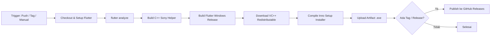

# Otomasi CI/CD Windows Kiosk (GitHub Actions)

Dokumen ini menjelaskan alur kerja dan panduan operasional pipeline **Continuous Integration / Continuous Delivery (CI/CD)** untuk aplikasi kiosk Windows SnapTechBooth.

---

## 1. Ringkasan & Manfaat

Pipeline CI/CD ini mengotomatiskan seluruh proses dari pengujian kode hingga perakitan installer setup Windows `.exe` di server cloud (GitHub Actions), tanpa membebani laptop/PC pengembang secara manual.

| Komponen | Penjelasan |
| --- | --- |
| **Platform** | GitHub Actions (`windows-latest` runner) |
| **File Konfigurasi** | [`.github/workflows/build-windows.yml`](../.github/workflows/build-windows.yml) |
| **Output Utama** | `installer/output/SnapTechBooth-Setup-<versi>.exe` |
| **Tempat Penyimpanan** | GitHub Actions Artifacts & GitHub Releases |

---

## 2. Alur Kerja Pipeline (*Workflow Stages*)

Setiap kali workflow dipicu, server cloud Windows akan menjalankan urutan langkah berikut secara otomatis:



1. **Persiapan Lingkungan**: Memuat Windows Server 2022/2025, Flutter SDK Stable, dan Visual Studio Build Tools.
2. **Quality Gate (CI)**: Menjalankan `flutter pub get` dan `flutter analyze`. Jika terdapat error sintaks atau missing import, proses langsung dibatalkan.
3. **Kompilasi C++ Helper**: Mengompilasi `sony_camera_helper.exe` menggunakan CMake (`tools/sony_camera_helper`).
4. **Kompilasi Flutter Windows**: Menjalankan `flutter build windows --release`.
5. **Bundling Dependensi**: Mengunduh `vc_redist.x64.exe` Microsoft resmi agar terintegrasi di dalam installer.
6. **Pembuatan Installer**: Mengompilasi skrip Inno Setup [`installer/snaptechbooth.iss`](../installer/snaptechbooth.iss) menggunakan `ISCC.exe`.
7. **Penyimpanan**: Mengunggah installer ke **GitHub Artifacts** (tersedia selama 30 hari).
8. **Rilis Publik (Opsional)**: Jika dijalankan dengan tag versi atau opsi rilis aktif, installer otomatis dipublikasikan ke halaman **GitHub Releases**.

---

## 3. Cara Menggunakan CI/CD

### A. Menjalankan Build Secara Manual (Web UI)
Gunakan cara ini kapan pun Anda ingin membuat file installer baru tanpa membuat tag rilis:

1. Buka repository di browser: `https://github.com/thisiswid/Photobooth`
2. Klik tab **Actions** di menu atas.
3. Di panel sebelah kiri, pilih **"Build & Release Windows Kiosk"**.
4. Klik tombol dropdown **"Run workflow"** di sisi kanan:
   - **Use workflow from**: Pilih branch yang ingin di-build (misal `feat/ui-redesign` atau `main`).
   - **Publish as GitHub Release?**: Biarkan `false` jika hanya ingin mengunduh file sementara (Artifact), atau pilih `true` jika ingin langsung jadi rilis resmi.
   - **Release tag**: Isi nama versi (misal `v1.0.1`) jika opsi rilis dicentang.
5. Klik tombol hijau **"Run workflow"**.
6. Tunggu proses selesai (~5–8 menit). Setelah centang hijau, klik nama run tersebut dan scroll ke bagian **Artifacts** di bawah untuk mengunduh file `.exe`.

### B. Membuat Rilis Versi Otomatis (Git Tag)
Setiap kali Anda membuat tag versi di Git dan mem-push-nya, GitHub Actions otomatis membuat release resmi:

```bash
# 1. Pastikan kode sudah di-commit
git commit -m "feat: rilis versi 1.0.1"

# 2. Buat tag rilis
git tag v1.0.1

# 3. Push tag ke GitHub
git push origin v1.0.1
```
Robot CI/CD akan otomatis berjalan, mem-build installer, dan melampirkan file `SnapTechBooth-Setup-1.0.0.exe` langsung di halaman **Releases** repository GitHub Anda.

---

## 4. Panduan untuk Teknisi Booth di Lokasi Kiosk

Untuk memperbarui aplikasi di unit booth:
1. Buka browser di unit booth, navigasi ke:
   `https://github.com/thisiswid/Photobooth/releases`
2. Unduh file `SnapTechBooth-Setup-<versi>.exe` terbaru.
3. Jalankan file installer dengan **Run as Administrator**.
4. Installer otomatis:
   - Menghentikan proses aplikasi dan helper kamera yang sedang berjalan.
   - Memperbarui binary Flutter dan helper C++.
   - Memasang kembali autostart ke startup Windows.
   - Menjalankan kembali aplikasi secara otomatis.

---

## 5. Catatan Teknis & Troubleshooting

* **Peringatan Windows SmartScreen**:
  Karena installer belum ditandatangani dengan sertifikat EV Code Signing komersial, Windows Defender SmartScreen mungkin menampilkan layar biru: *"Windows protected your PC"*.
  *Solusi*: Klik **"More info"** lalu pilih **"Run anyway"**.
* **Batas Kuota GitHub Actions**:
  Akun private GitHub mendapatkan kuota gratis 2.000 menit per bulan. Satu kali build Windows memakan waktu ~5–8 menit (dengan pengali Windows 2x, setara ~10–16 menit kuota). Ini mencukupi untuk puluhan kali build per bulan. Disarankan menggunakan pemicu manual (*workflow_dispatch*) atau tag rilis daripada memicu build di setiap push kecil.
