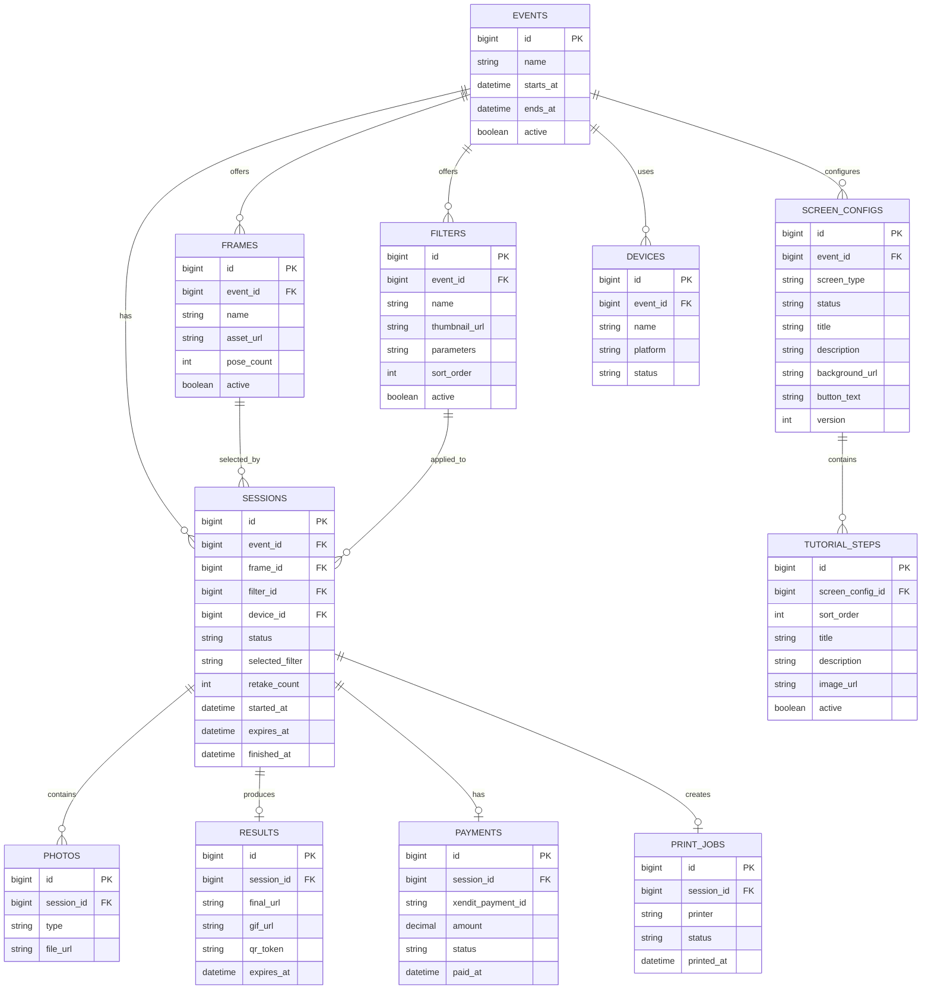

# ERD

## Critical relationships

- `SESSIONS.frame_id` must be set during **Frame Selection**, before Photo Session starts.
- `SESSIONS.filter_id` is set during **Filter Selection**, after all captures are accepted.
- `FRAMES.pose_count` determines how many photos are taken per session.
- `expires_at = started_at + 5 minutes`.
- `RESULTS` stores final_url, gif_url, and qr_token — presented on the single Result Screen.
- **No email field** anywhere in the schema.
