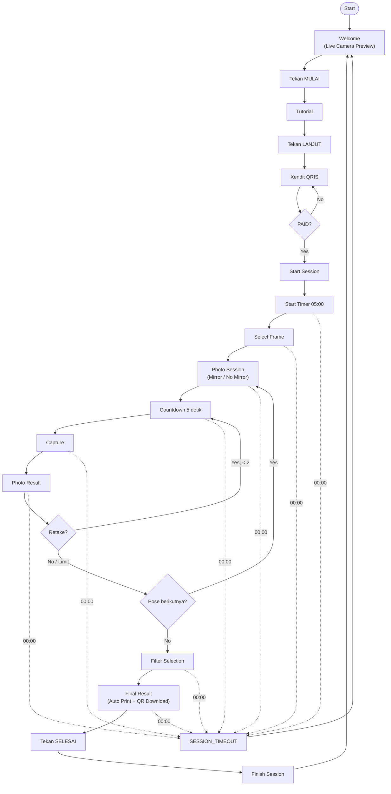

# Activity Diagram

```mermaid
flowchart TD
    A([Start]) --> B["Welcome\n(Live Camera Preview)"]
    B --> C["Tekan MULAI"]
    C --> D["Tutorial"]
    D --> E["Tekan LANJUT"]
    E --> F["Xendit QRIS"]
    F --> G{"PAID?"}
    G -->|No| F
    G -->|Yes| H["Start Session"]
    H --> I["Start Timer 05:00"]
    I --> J["Select Frame"]
    J --> K["Photo Session\n(Mirror / No Mirror)"]
    K --> L["Countdown 5 detik"]
    L --> M["Capture"]
    M --> N["Photo Result"]
    N --> O{"Retake?"}
    O -->|Yes, < 2| L
    O -->|No / Limit| P{"Pose berikutnya?"}
    P -->|Yes| K
    P -->|No| Q["Filter Selection"]
    Q --> R["Final Result\n(Auto Print + QR Download)"]
    R --> S["Tekan SELESAI"]
    S --> T["Finish Session"]
    T --> B
    I -. "00:00" .-> X["SESSION_TIMEOUT"]
    J -. "00:00" .-> X
    K -. "00:00" .-> X
    L -. "00:00" .-> X
    M -. "00:00" .-> X
    N -. "00:00" .-> X
    Q -. "00:00" .-> X
    R -. "00:00" .-> X
    X --> B
```
