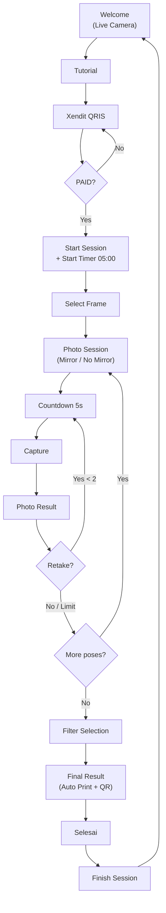

# Customer Flow

## Canonical Flow

`Welcome (Live Camera) → Tutorial → Xendit Payment → PAID → Start Session → Select Frame → Photo Session (Mirror/No Mirror) → 5-second Countdown → Capture → Photo Result (Retake/Next) → [repeat per pose] → Filter Selection → Final Result (Auto Print + QR) → Selesai → Finish → Welcome`

