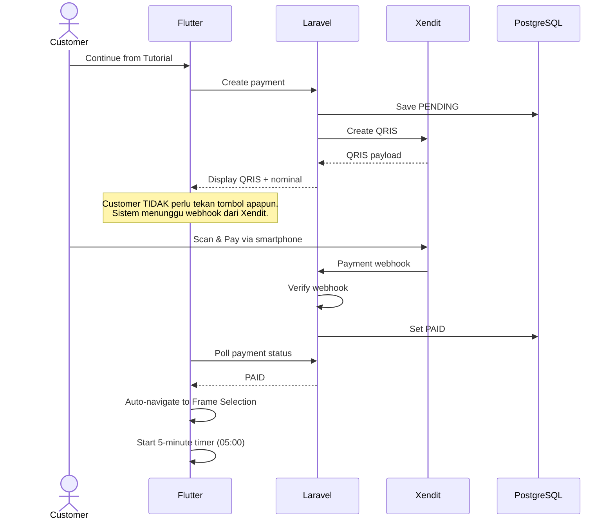

# Payment Flow

## Notes
- Customer tidak perlu menekan tombol "Sudah Bayar" atau apapun.
- Sistem otomatis lanjut ke Frame Selection setelah webhook diterima.
- Timer 5 menit **dimulai di sini**, bukan di Welcome/Tutorial.
