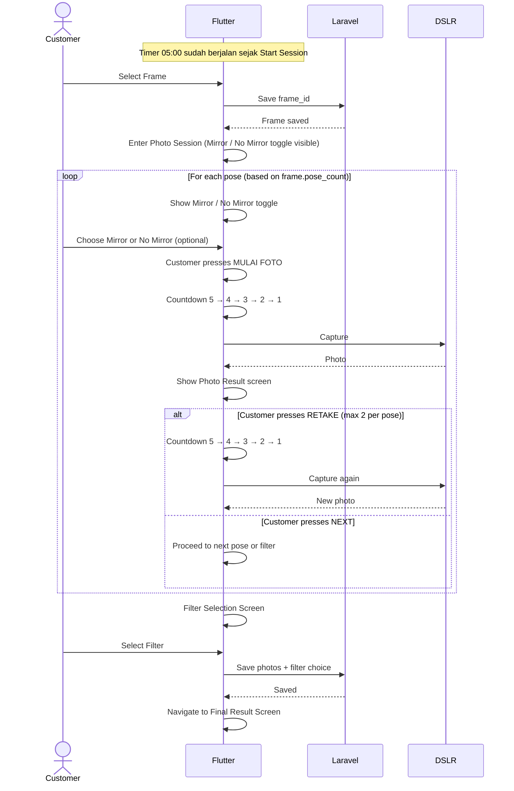

# Photo Session Flow

```mermaid
sequenceDiagram
    actor Customer
    participant App as Flutter
    participant API as Laravel
    participant Camera as DSLR

    Note over App: Timer 05:00 sudah berjalan sejak Start Session
    Customer->>App: Select Frame
    App->>API: Save frame_id
    API-->>App: Frame saved
    App->>App: Enter Photo Session (Mirror / No Mirror toggle visible)

    loop For each pose (based on frame.pose_count)
        App->>App: Show Mirror / No Mirror toggle
        Customer->>App: Choose Mirror or No Mirror (optional)
        App->>App: Customer presses MULAI FOTO
        App->>App: Countdown 5 → 4 → 3 → 2 → 1
        App->>Camera: Capture
        Camera-->>App: Photo
        App->>App: Show Photo Result screen

        alt Customer presses RETAKE (max 2 per pose)
            App->>App: Countdown 5 → 4 → 3 → 2 → 1
            App->>Camera: Capture again
            Camera-->>App: New photo
        else Customer presses NEXT
            App->>App: Proceed to next pose or filter
        end
    end

    App->>App: Filter Selection Screen
    Customer->>App: Select Filter
    App->>API: Save photos + filter choice
    API-->>App: Saved
    App->>App: Navigate to Final Result Screen
```
