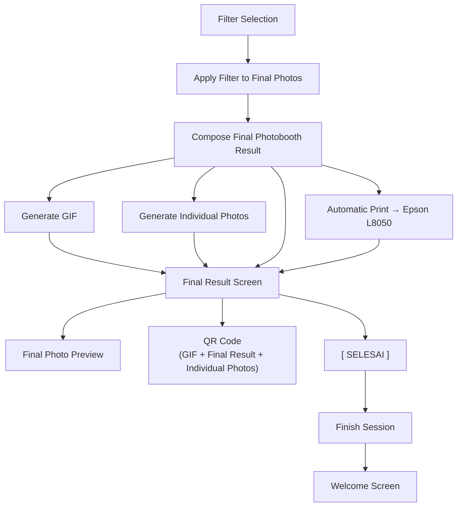

# Final Result Flow



## Result Screen layout

```
┌──────────────────────┬──────────────────┐
│                      │                  │
│                      │   QR DOWNLOAD    │
│   FINAL PHOTO        │                  │
│     PREVIEW          │   [ QR CODE ]    │
│                      │                  │
│                      │ Scan untuk       │
│                      │ download hasil   │
└──────────────────────┴──────────────────┘

              [ ✓ SELESAI ]
```

- **Final Photo Preview** — composed photobooth strip with selected filter
- **QR Code** — links to `GET /api/results/{token}` for downloading GIF, final result, and individual photos
- **SELESAI button** — finishes session and returns to Welcome Screen
- **Print** — triggered **automatically** when this screen is shown (no print button)
- **No email** — results are accessed via QR Code only
