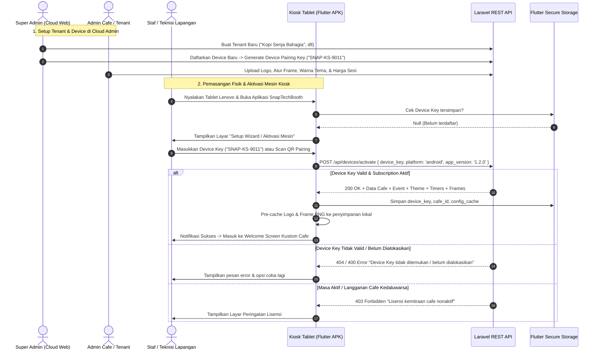

# Flow & Panduan Operasional: Device Provisioning & Multi-Tenant Onboarding

Dokumen ini menjelaskan alur operasional dan teknis dari **SnapTechBooth** dalam mendaftarkan, menghubungkan (*pairing*), mengelola, dan mengoperasikan perangkat kiosk untuk berbagai Admin Cafe / Tenant.

---

## 1. Alur Lengkap Onboarding Mesin Baru (End-to-End)



---

## 2. Diagram Aktivitas Kiosk Runtime & Sinkronisasi

```mermaid
flowchart TD
    AppStart([Buka SnapTechBooth APK]) --> CheckPairing{Sudah Di-pairing?}
    
    CheckPairing -- Belum --> ShowProvisioningUI[Tampilkan Layar Aktivasi Device]
    ShowProvisioningUI --> InputKey[Input Device Key / Scan QR]
    InputKey --> CallActivate[Panggil POST /api/devices/activate]
    CallActivate -- Gagal --> ShowErrorToast[Tampilkan Pesan Error] --> ShowProvisioningUI
    CallActivate -- Sukses --> SaveStorage[Simpan Config di Secure Storage]
    
    CheckPairing -- Sudah --> FetchLatestConfig[Fetch GET /api/devices/{key}/config]
    SaveStorage --> FetchLatestConfig
    
    FetchLatestConfig -- Ada Internet --> UpdateCache[Perbarui Cache Lokal & Dynamic State]
    FetchLatestConfig -- Offline / No Internet --> UseOfflineCache[Gunakan Konfigurasi Terakhir dari Cache]
    
    UpdateCache --> WelcomeScreen[Tampilkan Welcome Screen Cafe Terkait]
    UseOfflineCache --> WelcomeScreen
    
    WelcomeScreen --> StartHeartbeatTimer[Jalankan Heartbeat Telemetry Tiap 60 Detik]
    WelcomeScreen --> CustomerSession[Pelanggan Mulai Sesi Foto]
    
    subgraph "Hidden Admin Feature"
        WelcomeScreen -- "Tap 5x Pojok Atas" --> ShowPINModal[Input Master PIN Kiosk]
        ShowPINModal -- PIN Benar --> OpenKioskSettings[Buka Kiosk Settings & Hardware Diagnostic]
        OpenKioskSettings --> ActionChoice{Pilih Aksi}
        ActionChoice --> TestPrint[Test Cetak Foto Epson L8050]
        ActionChoice --> ForceSync[Force Sync / Refresh Config]
        ActionChoice --> ResetDevice[Unpair / Reset Device]
        ResetDevice --> ClearStorage[Hapus Cache & Device Key] --> ShowProvisioningUI
    end
```

---

## 3. Desain Tampilan Layar Aktivasi (Provisioning Wizard)

Ketika aplikasi pertama kali dijalankan (atau setelah di-*reset*), aplikasi tidak langsung menampilkan layar foto, melainkan **Setup Wizard**:

```
+-----------------------------------------------------------------------+
|  [ SNAPTECH BOOTH - KIOSK ACTIVATION WIZARD ]            (v1.2.0)     |
+-----------------------------------------------------------------------+
|                                                                       |
|             +-------------------------------------------+             |
|             |          [ LOGO SNAPTECH BOOTH ]          |             |
|             |                                           |             |
|             |   Masukkan Device Pairing Key yang       |             |
|             |   diberikan oleh Super Admin / Vendor     |             |
|             |                                           |             |
|             |   +-------------------------------------+ |             |
|             |   |  SNAP-FK-8821                       | |             |
|             |   +-------------------------------------+ |             |
|             |                                           |             |
|             |   [ HUBUNGKAN & AKTIFKAN MESIN ]          |             |
|             |                                           |             |
|             |   -- ATAU --                              |             |
|             |                                           |             |
|             |   [ SCAN QR CODE PAIRING ]                |             |
|             |                                           |             |
|             |   [O] Server URL: https://api.snaptech.id |             |
|             +-------------------------------------------+             |
|                                                                       |
+-----------------------------------------------------------------------+
```

---

## 4. Mekanisme Dynamic Theming & Rebranding

Setelah device teraktivasi untuk suatu cafe, komponen UI Flutter akan mengambil nilai dari `tenantConfigProvider`:

| Komponen UI | Sumber Data Hardcoded Lama | Sumber Data Multi-Tenant Baru |
|---|---|---|
| **Judul Welcome** | `"FAKULTAS KOPI"` | `tenant.cafe.name` / `tenant.screens.welcome.title` |
| **Logo Utama** | `assets/images/logo.png` | `CachedNetworkImage(tenant.cafe.logoUrl)` |
| **Warna Aksen** | `0xFFD97706` (Coffee Amber) | `Color(parseHex(tenant.cafe.theme.primaryColor))` |
| **Pilihan Frame** | Daftar Frame Lokal Tetap | `tenant.frames` (Diunduh sesuai Event aktif cafe) |
| **Harga Sesi** | `Rp 25.000` (Statis) | `formatRupiah(tenant.pricing.sessionPrice)` |
| **Watermark Cetak**| Teks statis `Fakultas Kopi` | Logo Cafe & Teks Nama Cafe dari Server |
| **Waktu Countdown**| 5 Detik (Statis) | `tenant.timers.cameraCountdownSeconds` |

---

## 5. Penanganan Kondisi Khusus & Error Recovery

1. **Jaringan Internet Mati / Flapping**:
   - Flutter menyimpan seluruh konfigurasi terakhir di disk lokal (`FlutterSecureStorage` + `FileCache`).
   - Sesi foto, rendering composite, dan print lokal ke Epson L8050 tetap dapat berjalan offline.
   - Hasil foto dan log transaksi diantrikan (*queue*) dan otomatis diunggah ketika internet kembali tersambung.
2. **Device Dipindahkan ke Cafe Lain (Relokasi Mesin)**:
   - Staf membuka menu tersembunyi dengan PIN admin.
   - Pilih tombol **"Unpair & Reset Device"**.
   - Masukkan Device Key cafe tujuan yang baru. Seluruh aset brand lama dihapus dan digantikan aset brand baru tanpa perlu *reinstall* APK.
3. **Lisensi Cafe Dinonaktifkan oleh Super Admin**:
   - Saat heartbeat atau fetch config mendeteksi status `inactive` / `suspended`, layar kiosk menampilkan pesan pemeliharaan (*"Booth sedang dalam pemeliharaan. Silakan hubungi pengelola."*) dan mengunci fungsi foto.
