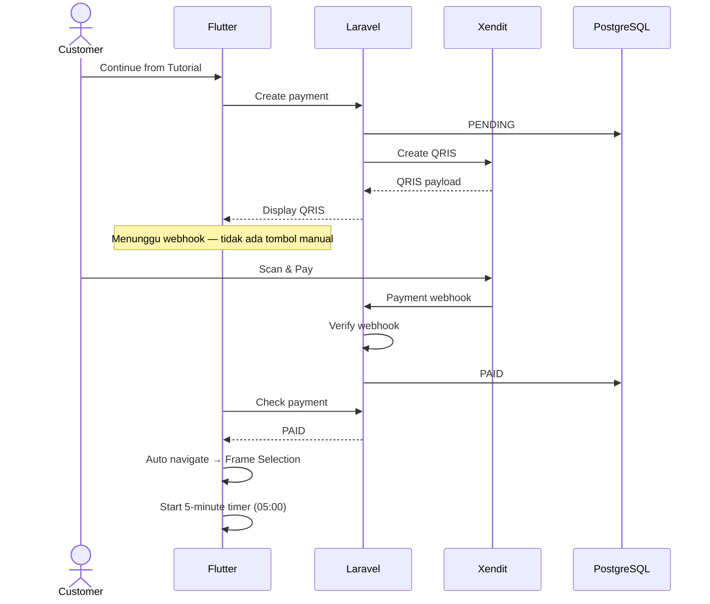

# Sequence — Payment to Frame Selection

```mermaid
sequenceDiagram
    actor Customer
    participant App as Flutter
    participant API as Laravel
    participant X as Xendit
    participant DB as PostgreSQL

    Customer->>App: Continue from Tutorial
    App->>API: Create payment
    API->>DB: PENDING
    API->>X: Create QRIS
    X-->>API: QRIS payload
    API-->>App: Display QRIS
    Note over App: Menunggu webhook — tidak ada tombol manual
    Customer->>X: Scan & Pay
    X->>API: Payment webhook
    API->>API: Verify webhook
    API->>DB: PAID
    App->>API: Check payment
    API-->>App: PAID
    App->>App: Auto navigate → Frame Selection
    App->>App: Start 5-minute timer (05:00)
```
