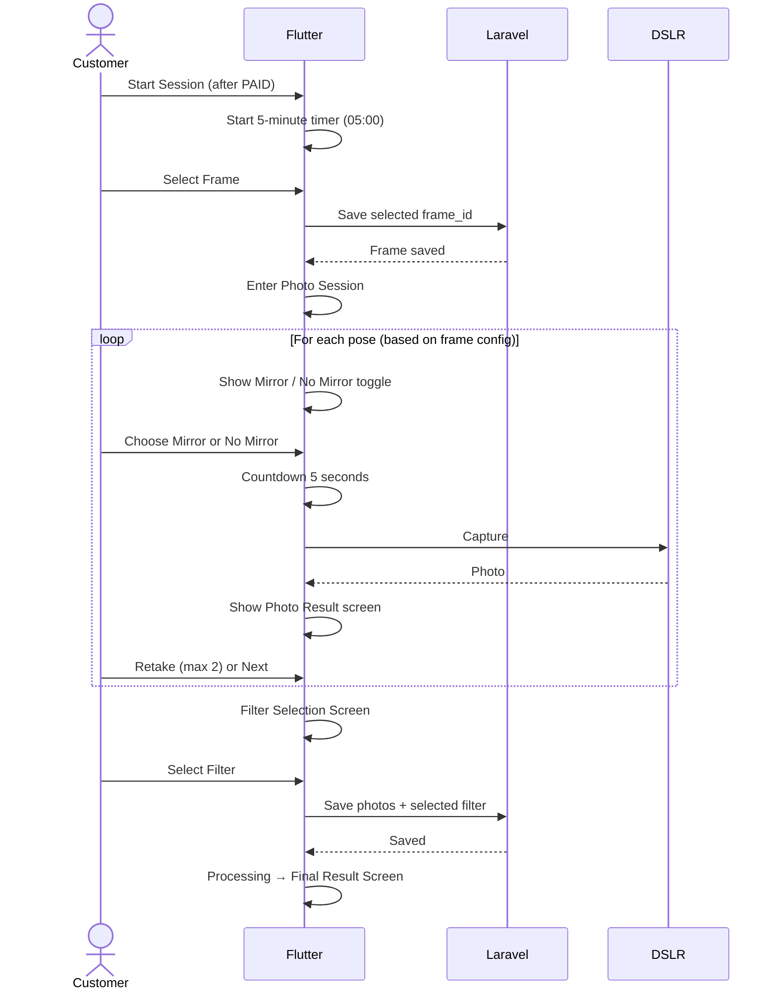

# Photo Session Flow

```mermaid
sequenceDiagram
    actor Customer
    participant App as Flutter
    participant API as Laravel
    participant Camera as DSLR

    Customer->>App: Start Session (after PAID)
    App->>App: Start 5-minute timer (05:00)
    Customer->>App: Select Frame
    App->>API: Save selected frame_id
    API-->>App: Frame saved
    App->>App: Enter Photo Session

    loop For each pose (based on frame config)
        App->>App: Show Mirror / No Mirror toggle
        Customer->>App: Choose Mirror or No Mirror
        App->>App: Countdown 5 seconds
        App->>Camera: Capture
        Camera-->>App: Photo
        App->>App: Show Photo Result screen
        Customer->>App: Retake (max 2) or Next
    end

    App->>App: Filter Selection Screen
    Customer->>App: Select Filter
    App->>API: Save photos + selected filter
    API-->>App: Saved
    App->>App: Processing → Final Result Screen
```
