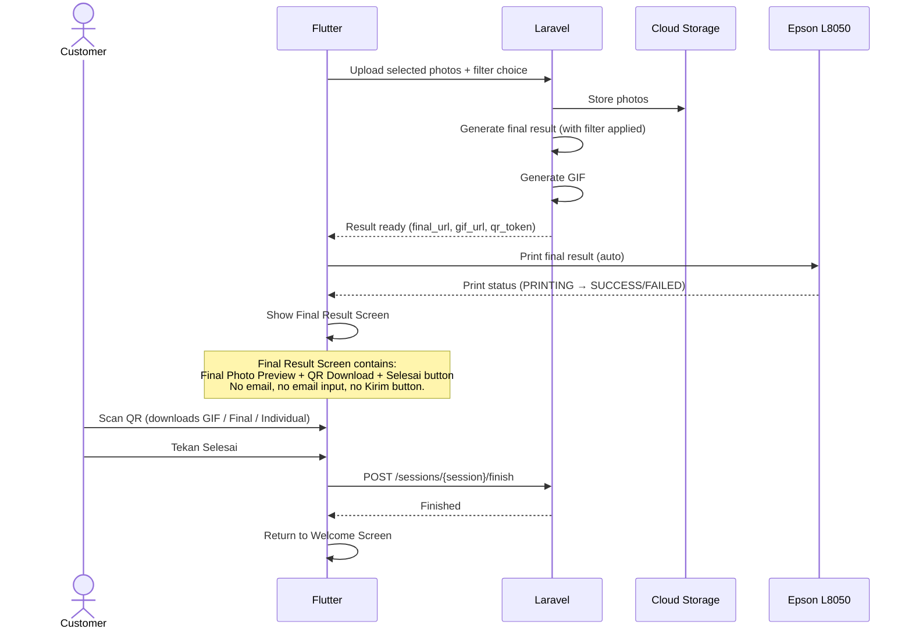

# Sequence — Final Result

```mermaid
sequenceDiagram
    actor Customer
    participant App as Flutter
    participant API as Laravel
    participant Storage as Cloud Storage
    participant Printer as Epson L8050

    App->>API: Upload selected photos + filter choice
    API->>Storage: Store photos
    API->>API: Generate final result (with filter applied)
    API->>API: Generate GIF
    API-->>App: Result ready (final_url, gif_url, qr_token)
    App->>Printer: Print final result (auto)
    Printer-->>App: Print status (PRINTING → SUCCESS/FAILED)
    App->>App: Show Final Result Screen
    Note over App: Final Result Screen contains:<br/>Final Photo Preview + QR Download + Selesai button<br/>No email, no email input, no Kirim button.

    Customer->>App: Scan QR (downloads GIF / Final / Individual)
    Customer->>App: Tekan Selesai
    App->>API: POST /sessions/{session}/finish
    API-->>App: Finished
    App->>App: Return to Welcome Screen
```
