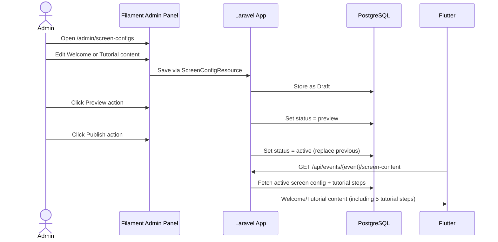

# Sequence — Welcome & Tutorial Content



## Tutorial Steps API Response
```json
{
  "welcome": { "title": "...", "description": "...", "button_text": "MULAI" },
  "tutorial": {
    "title": "...",
    "button_text": "LANJUT",
    "tutorial_steps": [
      { "sort_order": 1, "title": "BAYAR", "description": "Scan QRIS untuk melakukan pembayaran." },
      { "sort_order": 2, "title": "PILIH FRAME", "description": "Pilih frame favorit untuk foto kamu." },
      { "sort_order": 3, "title": "AMBIL FOTO", "description": "Siapkan pose dan foto akan diambil setelah countdown." },
      { "sort_order": 4, "title": "LIHAT HASIL", "description": "Lihat hasil foto dan pilih filter yang kamu suka." },
      { "sort_order": 5, "title": "DOWNLOAD & CETAK", "description": "Scan QR untuk download hasil atau cetak foto." }
    ]
  }
}
```
