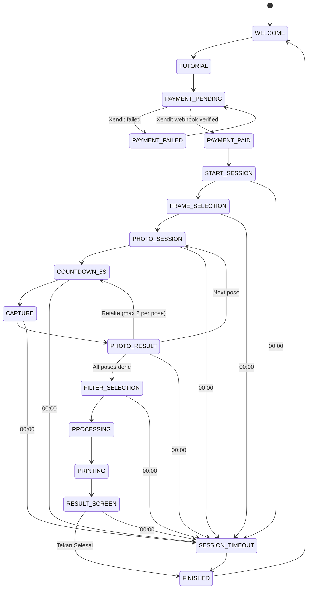

# Session State Machine

## State Descriptions

| State | Description |
|-------|-------------|
| `WELCOME` | Welcome screen dengan live camera preview |
| `TUTORIAL` | Tutorial 5 langkah |
| `PAYMENT_PENDING` | QRIS ditampilkan, menunggu Xendit webhook |
| `PAYMENT_FAILED` | Pembayaran gagal, bisa retry |
| `PAYMENT_PAID` | Xendit webhook konfirmasi PAID |
| `START_SESSION` | Session dibuat, timer 05:00 dimulai |
| `FRAME_SELECTION` | Customer memilih frame |
| `PHOTO_SESSION` | Halaman kamera aktif (Mirror/No Mirror) |
| `COUNTDOWN_5S` | Countdown 5 detik sebelum capture |
| `CAPTURE` | DSLR mengambil foto |
| `PHOTO_RESULT` | Customer melihat hasil foto, bisa Retake atau Next |
| `FILTER_SELECTION` | Customer memilih filter setelah semua pose selesai |
| `PROCESSING` | Backend generate final result + GIF |
| `PRINTING` | Epson L8050 mencetak (otomatis) |
| `RESULT_SCREEN` | Final photo preview + QR download + tombol Selesai |
| `FINISHED` | Session ditutup, kembali ke Welcome |
| `SESSION_TIMEOUT` | Timer 00:00, session otomatis ditutup |

## No Email
There is no `SEND_EMAIL` state. No email anywhere in the state machine.
