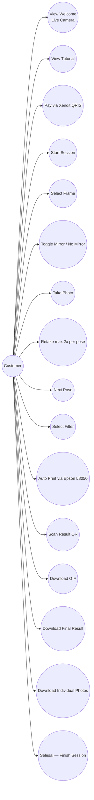

# Customer Use Cases

## Notes
- Welcome Screen menampilkan live camera preview sebagai background.
- Payment verification otomatis via Xendit webhook — customer tidak perlu tekan tombol apapun.
- Photo Result screen muncul setelah setiap capture — customer bisa Retake (max 2) atau Next.
- Jika frame punya multiple pose, cycle Countdown→Capture→Photo Result berulang per pose.
- Filter Selection setelah semua pose selesai.
- Print otomatis saat Final Result Screen ditampilkan.
- Final Result Screen berisi: photo preview, QR download, tombol Selesai.
- **Tidak ada email** di seluruh flow customer.
