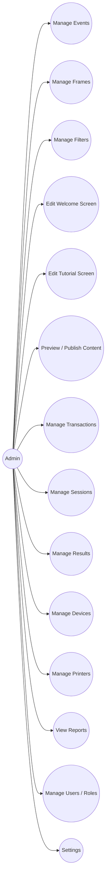

# Admin Use Cases

## Implementation — Filament PHP (inside Laravel)

All admin use cases are implemented as **Filament Resources, Pages, and Actions** within the same Laravel application as the REST API.

| Use Case | Filament Implementation |
|----------|------------------------|
| Manage Events | `EventResource` — list, create, edit, delete, toggle active |
| Manage Frames | `FrameResource` — list, create, edit, delete, upload `asset_url`, toggle active |
| Manage Filters | `FilterResource` — list, create, edit, delete, upload `thumbnail_url`, toggle active, reorder |
| Edit Welcome Screen | `ScreenConfigResource` filtered by `screen_type = welcome` |
| Edit Tutorial Screen | `ScreenConfigResource` filtered by `screen_type = tutorial` |
| Preview / Publish Content | Custom `PreviewAction` and `PublishAction` on `ScreenConfigResource` |
| Manage Transactions | `TransactionResource` — view, filter by status/date |
| Manage Sessions | `SessionResource` — view, detail page with photos + result + print jobs |
| Manage Results | `ResultResource` — view final results, QR tokens, expiry |
| Manage Devices | `DeviceResource` — CRUD |
| Manage Printers | `PrinterResource` — CRUD |
| View Reports | `ReportPage` with Filament Widgets (stats, charts) |
| Manage Users / Roles | `UserResource` + **Filament Shield** for RBAC |
| Settings | `SettingsPage` |

## Manage Filters detail

| Action | Description |
|--------|-------------|
| Create filter | Name, preview thumbnail upload, filter parameters, sort order |
| Edit filter | Update any field |
| Toggle active | Only active filters appear on the customer Filter Selection screen |
| Delete filter | Remove permanently |
| Reorder | Drag-and-drop sort_order in Filament table |
