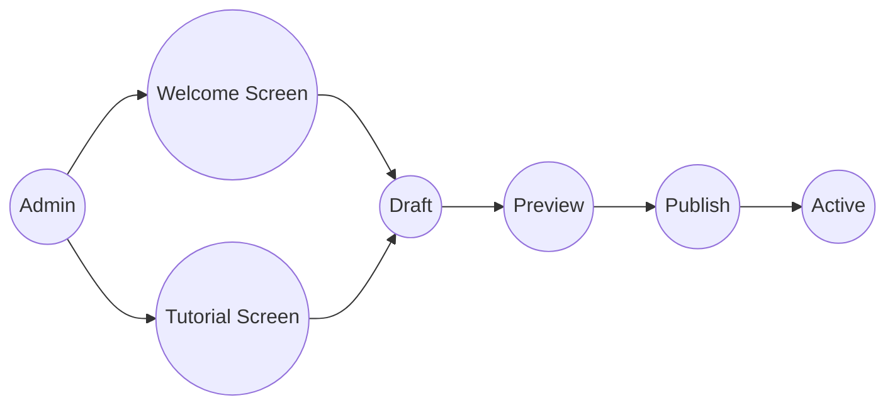

# Screen Management Use Cases

## Lifecycle
`Draft → Preview → Publish → Active`

- **Draft**: Admin edits content, not visible to customers.
- **Preview**: Admin can preview how it looks on the Flutter app before publishing.
- **Publish**: Content is pushed to Active.
- **Active**: Flutter app fetches and displays this version.
